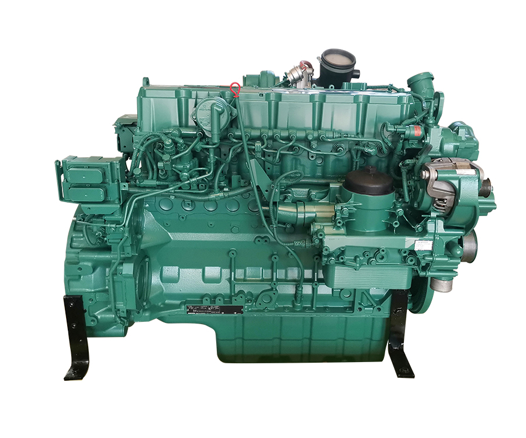

If U have any question of Deutz engine,feel free to contact me through whatsapp+8619116391990

#### DEUTZ ENGINE REMAN TCD2013L062V(VOLVO D7E)

#### DEUTZ REMAN ENGINE TCD2012L062V(VOLVO D6E)

#### DEUTZ ENGINE REMAN TCD2013L042V

#### DEUTZ ENGINE REMAN TD2.9

#### DEUTZ ENGINE REMAN BF4M2011

#### DEUTZ ENGINE REMAN BF6M1013

#### DEUTZ ENGINE REMAN D2011L03I

#### DEUTZ ENGINE REMAN F6L912

#### DEUTZ ENGINE REMAN F6L914

#### DEUTZ ENGINE REMAN F8L413

#### DEUTZ ENGINE REMAN TCD7.8L6(VOLVOD8K)

#### DEUTZ ENGINE REMAN TCD2012L04

